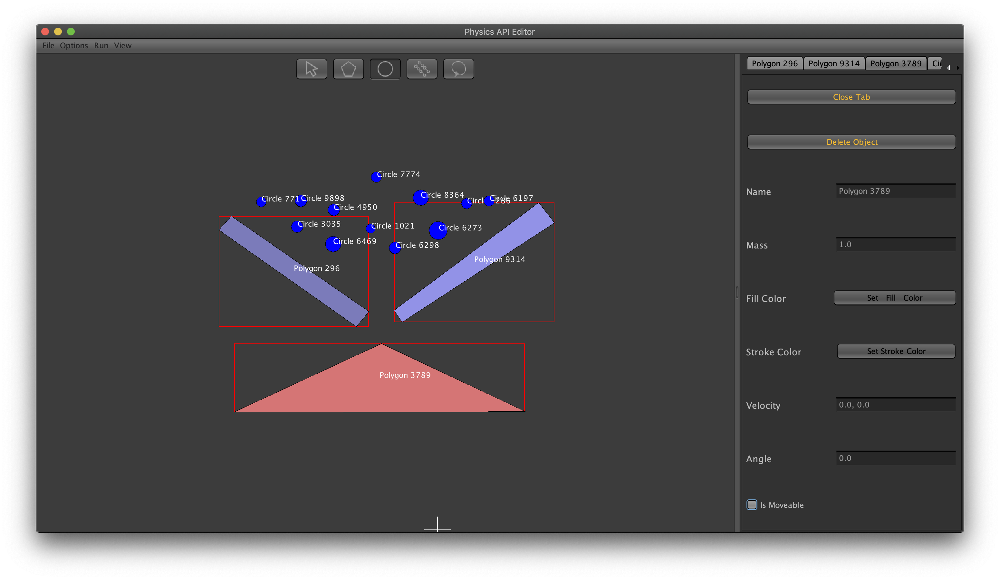

# Java Physics Engine

[](https://travis-ci.com/EKarton/Java-Physics-Engine) [](https://codecov.io/gh/EKarton/Java-Physics-Engine)

### Description
The Java Physics Engine aims to incorporate physics capabilities to any Java projects easily. Equipped with advanced physics and object collision algorithms, the Java Physics Engine can simulate and handle object collisions realistically in 2D space. The sky is the limit when it comes to creating games with the Java Physics Engine!

The Java Physics Engine is a project made during my final year in high school. The project is comprised of two components: the Java Physics Engine API and the Java Physics Engine GUI Editor. 

### Table of Contents
- Walkthrough
- Installation
- Usage
- Credits
- License

### Walkthrough of this project
This project consists of several components, each responsible for performing a certain task. The image below illustrates the system architecture of the project.
<div width="100%">
    <p align="center">

    </p>
</div>

When a user launches the GUI editor, they will be able to create objects using the GUI editor:
<div width="100%">
    <p align="center">
    
    </p>
</div>

When the user clicks on the "Run Simulation" button (in the menu bar), they will be able to see the simulation of their objects:
<div width="100%">
    <p align="center">
    
    </p>
</div>

### Installation
##### Required Programs and Tools:
- Java SDK >= 1.8

##### Running the program through the command line
- Open the terminal and change the directory to the root project directory.
- Run the command ```mvn clean install```.
- Change directories to ```gui/target```.
- Run the GUI editor by changing directories to ```gui/target``` and running the command ```java -jar gui-2.0.jar```.

##### Experimental
- You can run the tests in parallel by executing ```mvn -T 1C surefire:test``` instead of ```mvn clean install test```
- You can also disable running the tests by executing ```mvn clean install -DskipTests=true``` instead of ```mvn clean install```

### Usage
Please note that this project is used for educational purposes and is not intended to be used commercially. We are not liable for any damages/changes done by this project.

### Credits
EKarton

### License
This project is protected under the GNU licence. Please refer to the Licence.txt for more information.
